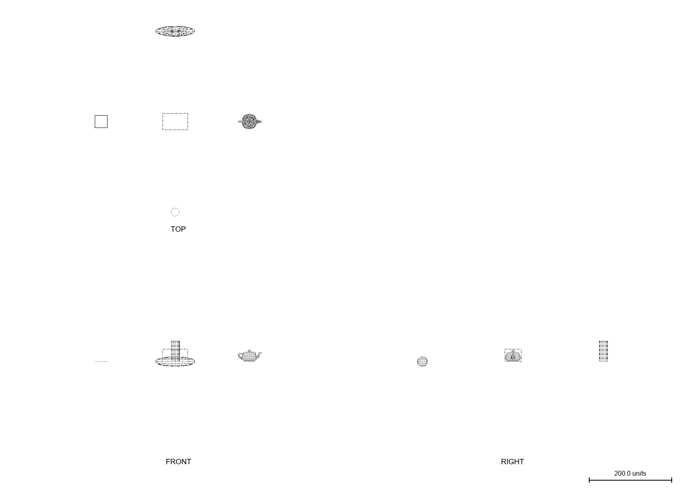

# LineViewExporter for 3ds Max / Blender

**Export Front / Side / Top orthographic line views of any 3D model as fully editable vector paths for Adobe Illustrator.**

Two versions of the same tool live in this repo:

| File | For | Platform |
|---|---|---|
| `LineViewExporter.ms` | 3ds Max (MAXScript, drag-and-drop) | Windows only |
| `LineViewExporter_Blender.py` | Blender (addon) | **macOS** / Windows / Linux |

## I'm on a Mac — what do I use?

3ds Max has **no macOS version**, so the `.ms` script cannot run on a Mac. You have two easy routes:

1. **You just need the line drawing** (no 3D app needed): the exported `.svg` is cross-platform — whoever has the model on Windows can export it and send you the file; it opens in Illustrator on the Mac as fully editable paths.
2. **You want to export it yourself on the Mac**: use the **Blender addon** in this repo — same algorithm, same output:
   1. Install [Blender](https://www.blender.org/download/) (free, native macOS)
   2. Bring your model over (FBX / OBJ / glTF export from 3ds Max, or open a `.blend`)
   3. In Blender: **Edit > Preferences > Add-ons > Install** (called *Install from Disk* in 4.2+) → pick `LineViewExporter_Blender.py` → enable **Import-Export: Line View Exporter**
   4. Select your objects (no selection = all visible meshes), press **N** in the 3D viewport → **Line View** tab → **Export Line Views SVG**

## Example output

Preview of the automated test scene (box, teapot, flat plane, 18-sided cylinder, stretched sphere), exported with hidden lines on:

*(Preview rasterized from the SVG with a simple script — in Adobe Illustrator / any browser the SVG is fully editable vector.)*

## Quick Start (3ds Max, Windows)

1. Open your model scene in 3ds Max (2014–2026).
2. Drag `LineViewExporter.ms` into any viewport → a dialog opens.
3. (Optional) Select the objects to export — no selection = all visible, unfrozen geometry.
4. Pick views (Front / Right / Top by default; Back / Left / Bottom optional) → **EXPORT LINE VIEWS**.
5. Open the resulting `.svg` in Adobe Illustrator. Done — it's all editable vectors.

## Quick Start (Blender, any platform)

1. Install the addon as described above.
2. Select objects (or leave nothing selected to use all visible meshes).
3. `N` sidebar → **Line View** → **Export Line Views SVG** — same options as the Max version, same blueprint-style SVG output.

## What it does

| Feature | Description |
|---|---|
| 6 orthographic views | Front / Right / Top enabled by default, plus Back / Left / Bottom |
| Smart line extraction | Draws only **silhouettes, open edges and creases** — smooth internal edges are skipped, so you get a clean drawing instead of wireframe soup |
| Hidden lines | Optional grey **dashed** lines for edges hidden behind the model (technical-drawing style) |
| Blueprint layout | Third-angle sheet: Top above, Front center, Right at right — auto-aligned, auto-fit to A4/A3, with scale bar and view labels |
| Illustrator-friendly | One named group per view, one path per 3ds Max object; stroke weight and dashes are live stroke attributes |

## Options

- **Crease angle (default 30°)** — an edge shared by two faces is drawn only if the faces bend more than this. Lower (10–20°) = more detail lines; higher (40–60°) = outlines and big features only. Turn it up for dense, tessellated surfaces.
- **Stroke weight (default 0.5 pt)** — line weight in Illustrator.
- **Include hidden edges** — dashed grey lines for back-facing outlines/creases.
- **Flip facing test** — if the output looks inside-out (flipped mesh normals), tick this; no need to fix the model.
- **Sheet** — A4/A3 auto-fit with uniform scale, or "No fit" (1 max unit = 1 pt, true size).

## In Illustrator

- Each view is a named group (`FRONT`, `RIGHT`, `TOP`…); each Max object is a path named after it.
- Want real layers? Select the groups → Layers panel menu → **Release to Layers**.
- Hidden lines are ordinary dashed strokes — restyle freely.
- Save as native `.ai` afterwards if you like.

## Permanent install

1. Copy `LineViewExporter.ms` to `..\3dsMax\scripts\` or `%localappdata%\Autodesk\3dsMax\20xx - 64bit\ENU\scripts\`.
2. Customize > Customize User Interface → Category **LineView** → drag **LineViewToSVG** to a toolbar / menu / hotkey.
3. If you drop it in a *startup* scripts folder, delete the last line of the file (the auto-open line meant for drag-and-drop use).

## How it works

- 3ds Max's built-in `File > Export > Adobe Illustrator (.ai)` only exports splines in top view — it cannot extract lines from meshes, which is why this tool exists.
- For every polygon edge the script classifies it as: silhouette (one face toward viewer, one away), open edge (single face), or crease (face angle above threshold). Smooth internal edges are dropped — that's what keeps the drawing clean.
- Projections match the 3ds Max viewports (Front: +X right / +Z up; Top: +X right / +Y down).
- Output is SVG (user units = pt), which Illustrator opens natively as editable paths.

## Limitations / tips

- MAXScript speed: very high-poly meshes (hundreds of thousands of edges) can take minutes — consider ProOptimizer first.
- n-gon face normals are computed from the first three vertices; extreme non-planar faces may classify imperfectly (try the Flip option).
- "No fit" mode can generate huge pages for huge models (Illustrator artboard limit is 16383 pt).
- For render-grade vector effects (brush strokes, toon lines) look at commercial plugins: **Illustrate!** (David Gould) or **finalToon** (cebas).

---

# 繁體中文說明

**呢個 repo 有兩個版本,功能同輸出完全一樣:**

| 檔案 | 適用軟件 | 平台 |
|---|---|---|
| `LineViewExporter.ms` | 3ds Max(MAXScript,拖入即用) | 只限 Windows |
| `LineViewExporter_Blender.py` | Blender(addon) | **macOS** / Windows / Linux |

拖入 3ds Max、撳 Export、用 Illustrator 開個 SVG,所有線都係真正可編輯嘅 vector path(錨點、線粗、虛線、顏色任改)。

## Mac 用家睇呢度

3ds Max **冇 macOS 版**,`.ms` script 喺 Mac 行唔到。兩條路:

1. **只係要張線圖**:匯出嘅 `.svg` 係跨平台檔案 — 有 model 嗰位朋友(Windows)匯出之後傳個檔俾你,Mac 上 Illustrator 直接開,完全可編輯。
2. **想喺 Mac 自己匯出**:用呢個 repo 嘅 **Blender addon**(Blender 免費、Mac 原生):
   1. 裝 [Blender](https://www.blender.org/download/)
   2. 個 model 用 FBX / OBJ / glTF 由 3ds Max 帶過去(或者直接開 `.blend`)
   3. Blender:**Edit > Preferences > Add-ons > Install**(4.2+ 叫 *Install from Disk*)→ 揀 `LineViewExporter_Blender.py` → 剔啟用 **Import-Export: Line View Exporter**
   4. 揀住啲物件(唔揀 = 全部可見 mesh)→ 3D viewport 撳 **N** → **Line View** tab → **Export Line Views SVG**

## 快速開始(3ds Max,Windows)

1. 喺 3ds Max 開住你個 model 場景
2. 將 `LineViewExporter.ms` **拖入任何一個 viewport** → 自動彈出對話框
3. (可選)先揀住要匯出嘅物件;**唔揀 = 匯出所有可見、未 freeze 嘅 geometry**
4. 揀 views 同參數 → 撳 **EXPORT LINE VIEWS**
5. 用 Illustrator 開返個 `.svg`(預設喺 Max 嘅 export 資料夾)

## 功能

| 功能 | 說明 |
|---|---|
| 六個正視圖 | Front / Right / Top 預設開,另可加 Back / Left / Bottom |
| 智能抽線 | 只畫**輪廓線、開口邊、硬邊(crease)**,平滑內部線自動省略 — 出乾淨線稿,唔係亂曬嘅 wireframe |
| 隱藏線模式 | 灰色**虛線**畫背後嘅輪廓/硬邊,似技術圖則 |
| 藍圖排版 | 第三角投影:Top 上、Front 中、Right 右,自動對齊、自動 fit A4/A3,附比例尺同視圖名 |
| Illustrator 友好 | 每個 view 一個命名 group、每件 Max 物件一條 path;線粗、虛線全部係可改嘅 stroke 屬性 |

## 參數

- **Crease angle(預設 30°)**:兩面夾角大過呢個值先畫線。調細(10–20°)多細節;調大(40–60°)淨係大輪廓。曲面密線多就調大啲。
- **Stroke weight(預設 0.5pt)**:Illustrator 入面嘅線粗。
- **Include hidden edges**:背向嘅開口邊/硬邊以灰色虛線表示。
- **Flip facing test**:線圖「內外反轉」(mesh normals 翌咗)就勾呢個,唔使修 model。
- **Sheet**:A4/A3 自動排版 fit(統一比例、視圖對齊),或 1 max unit = 1 pt 原大輸出。

## 喺 Illustrator 入面

- 每個視圖一個命名 group,每件 3ds Max 物件一條 path(用返物件名)。
- 想要真圖層:選住 group → Layers 面板 → **Release to Layers**。
- 隱藏線係普通 dashed stroke,任改。
- 開完可 **File > Save As** 存做原生 `.ai`。

## 永久安裝

1. 複製 `LineViewExporter.ms` 去 `..\3dsMax\scripts\` 或 `%localappdata%\Autodesk\3dsMax\20xx - 64bit\ENU\scripts\`
2. **Customize > Customize User Interface** → Category `LineView` → `LineViewToSVG` 拖上 toolbar / menu / hotkey
3. 放 startup scripts 資料夾嘅話,刪走檔案最尾嗰行 auto-run

## 限制同貼士

- 幾十萬邊嘅高模會慢(MAXScript 速度所限,分鐘級),建議先 ProOptimizer 減面。
- n-gon 法線用首三點計,極端非平面面分類可能唔完美(配合 Flip 選項)。
- No fit 模式下超大 model 會生成超大頁面(Illustrator artboard 上限 16383pt)。
- 想要 render 級 vector 效果(筆刷風、卡通線)可以睇商業 plugin:**Illustrate!** 或 **finalToon**。

## License

MIT — 自由使用、修改、分享。
